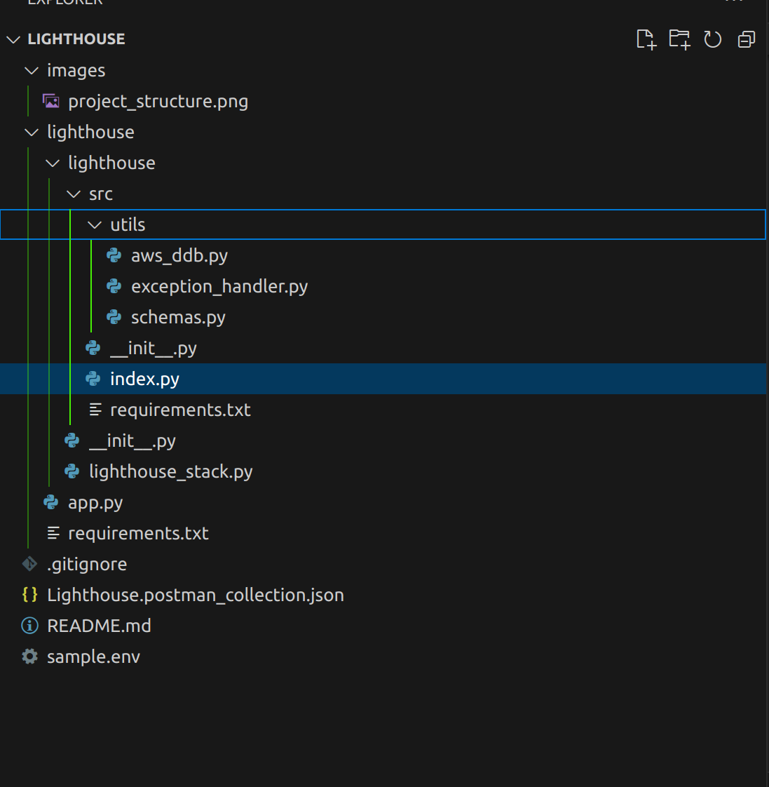

# Lighhouse Task Manager
> Problem Statement

You are tasked with creating a serverless CRUD (Create, Read, Update, Delete) API for managing a simple "Tasks" service. Each task contains the following attributes:

- `taskId` (string) – unique identifier for the task.

- `title` (string) – the title of the task.

- `description` (string) – a brief description of the task.

- `status` (string) – the current status of the task (`"pending"`, `"in-progress"`, or `"completed"`).

## Project Dependencies

- `Python >= 3.10`
- `Node.js >= 18.0.0` - <a href="https://nodejs.org/en/download/package-manager">Installation Guide</a>
- `AWS CDK == 2.158.0` - <a href="https://docs.aws.amazon.com/cdk/v2/guide/getting_started.html">Installation Guide</a>
- `Docker Desktop >= 4.0.0` - Docker is used for building Lambda assets
- `aws-cdk-lib == 2.158.0` - Python AWS CDK Library
- `constructs >=10.0.0,<11.0.0` - Python AWS CDK Constructs
- `python-dotenv == 1.0.1` - Python utility for processing .env files
- `pydantic == 2.9.1` - Pydantic is used for API data parsing and validation
- `boto3 == 1.35.19` - Python AWS SDK
- `botocore == 1.35.19` - Python AWS Low-Level SDK

## Project Directory Structure



- `lighthouse/app.py` - CDK entrypoint
- `lighthouse/lighthouse/lighthouse_stack.py` - AWS resources definitions
- `lighthouse/lighthouse/src` - AWS Lambda code
- `lighthouse/sample.env` - Rename this file to `.env` and provide the required variables
- `lighthouse/Lighthouse.postman_collection.json` - This Postman collection contain all the require API calls and tests. This file should be <a href="https://learning.postman.com/docs/getting-started/importing-and-exporting/importing-and-exporting-overview/">imported</a> in Postman and the entire collection ran in one go. NB: the {{base}} global Postman variable (API Gateway URL) should replaced with the value generated after a successful CDK deployment before running the tests.
<p></p>


## Installing

- Install the latest version of AWS CLI and <a href="https://docs.aws.amazon.com/cli/latest/reference/configure/">configure</a> it using a non-Root IAM user with sufficient privileges for provisioning the required resources.
- <a href="https://nodejs.org/en/download/package-manager">Install Node.js</a>
- <a href="https://docs.aws.amazon.com/cdk/v2/guide/getting_started.html">Install AWS CDK</a>
```shell
npm install -g aws-cdk
```
- Create a Python3 Virtual Environment

```shell
python3 -m venv lighthouse/.venv
```
- Change to the `lighthouse` directory

```shell
cd lighthouse
```
- Activate virtual environment

```shell
source ./.venv/bin/activate
```
- Install Python3 dependencies using PIP or PIP3
```shell
pip install -r requirements.txt
```
- Bootstrap AWS default profile (or any other profile with sufficient privileges) to AWS CDK
```shell
cdk bootstrap --profile default
```
- Sythensize CDK App (ensure Docker is running prior)
```shell
cdk synth
```
- Deploy stack to AWS
```shell
cdk deploy
```
- Once testing is completed the resources can be destroy. However, the DynamoDB table has to be deleted manually from the AWS console
```shell
cdk destroy
```
